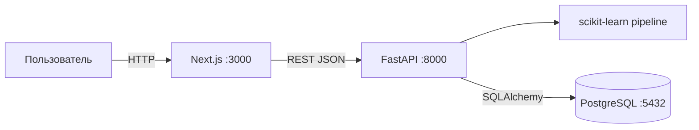
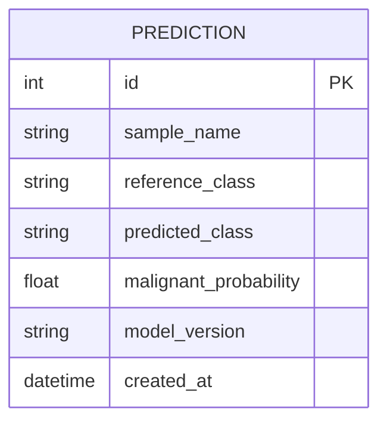

# Архитектура

## Назначение и ограничения

«ОнкоОтвет» — учебная демонстрация классификации Breast Cancer Wisconsin Diagnostic. Модель обучается через
`sklearn.datasets.load_breast_cancer` (569 записей, 30 признаков клеточных ядер) и предсказывает вероятность
класса malignant. Набор не содержит исходов терапии, поэтому результат нельзя трактовать как прогноз
эффективности лечения, диагноз или медицинскую рекомендацию. Не вводите персональные данные и реальные истории
болезни.

## Компоненты

Next.js показывает русскоязычные страницы классификации и истории. Клиент загружает фиксированные образцы и
метрики через `API_URL`, пользователь выбирает образец и отправляет его признаки на классификацию. FastAPI
валидирует 30 признаков WDBC Pydantic-схемой, вызывает сервис модели, сохраняет результат в SQLAlchemy и
возвращает JSON. Локальный backend по умолчанию использует SQLite; Compose подключает PostgreSQL 17.

## Модель данных

Сохраняются только имя образца, эталонная метка, предсказанный класс, вероятность malignant и версия модели.
Признаки в БД не хранятся. Актуальная схема создаётся миграциями `0001_predictions.py` →
`0002_wdbc_predictions.py`.

## ML pipeline

`backend/app/modules/predictions/ml.py` загружает WDBC, определяет положительный класс как исходный таргет
sklearn `0` (malignant), делает стратифицированный split 80/20 с `random_state=42` и обучает
`Pipeline(StandardScaler, LogisticRegression(max_iter=2000))`. Артефакт сохраняется по `MODEL_PATH`
(в Compose — volume `/app/models`). Функция `evaluate()` считает accuracy, precision, recall и ROC-AUC на
holdout; `demo_samples()` возвращает 4 фиксированных примера из тестовой выборки. Метрики — только учебная
оценка дискриминации, а не клиническая валидация.

## API

| Метод | Маршрут | Назначение |
|---|---|---|
| GET | `/health` | Health check процесса |
| GET | `/api/v1/predictions/samples` | Фиксированные WDBC-образцы |
| GET | `/api/v1/predictions/metrics` | Holdout-метрики модели |
| POST | `/api/v1/predictions` | Валидировать признаки, классифицировать и сохранить |
| GET | `/api/v1/predictions?limit=20` | Последние результаты |
| GET | `/docs` | Swagger UI |

Валидация требует ровно 30 признаков WDBC; иначе FastAPI возвращает 422. Ответ включает класс, вероятность
malignant, версию модели, временную метку и предупреждение.

## Запуск

Полные команды запуска, настройки SQLite/PostgreSQL, Compose и тестирования доступны в корневом README.
Сервисы Compose: `frontend`, `backend`, `db`; backend ждёт готовности БД и применяет Alembic перед запуском API.
